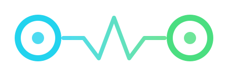

<p align="center">
  
</p>

<h3 align="center">Your entire infrastructure. One terminal.</h3>

<p align="center">
  <a href="https://github.com/hatembentayeb/omo/releases"></a>
  <a href="https://goreportcard.com/report/github.com/hatembentayeb/omo"></a>
  <a href="https://github.com/hatembentayeb/omo/blob/main/LICENSE"></a>
  <a href="https://github.com/hatembentayeb/omo/releases"></a>
  
  
</p>

<p align="center">
  <a href="https://oh-myops.com">Website</a> &bull;
  <a href="#installation">Install</a> &bull;
  <a href="#plugins">Plugins</a> &bull;
  <a href="#architecture">Architecture</a> &bull;
  <a href="#contributing">Contributing</a>
</p>

---

## Demo

<p align="center">
  <video src="assets/demo.mp4" width="800" controls autoplay loop muted></video>
</p>

---

## What is omo?

**omo** (OhMyOps) is an operations dashboard that runs entirely in your terminal. Instead of juggling dozens of browser tabs, CLI tools, and dashboards, omo gives you a single keyboard-driven interface to manage your entire infrastructure stack.

```
                   omo
                    |
     +---------+----+----+---------+
     |         |         |         |
  Docker    Redis     Kafka    ArgoCD   ...11 plugins
```

One binary. One config directory. Every service you run.

---

## Why omo?

**The problem:** You have Redis in one terminal, `docker ps` in another, k9s somewhere, the ArgoCD UI in a browser, and your AWS cost dashboard in yet another tab. Context switching kills your flow.

**The solution:** omo loads each service as a plugin and presents it through a consistent, keyboard-driven TUI. Filter, sort, search, and act on any resource -- all without leaving your terminal.

- **Keyboard-first** -- every action is one or two keystrokes away
- **Plugin architecture** -- only load what you need, build your own in Go
- **Secrets management** -- KeePass (KDBX4) integration keeps credentials out of config files
- **Cross-platform** -- Linux, macOS, Windows (Linux recommended for plugin `.so` support)
- **Fast** -- written in Go, launches in milliseconds

---

## Plugins

omo ships with 11 official plugins. Each one is a standalone `.so` binary that the host loads at runtime.

| Plugin | Description | Key Features |
|--------|-------------|--------------|
| **docker** | Containers, images, networks, volumes | Start/stop/restart, logs, exec, prune |
| **redis** | Keys, memory, clients, slowlog, pub/sub | Key browser, TTL management, live metrics |
| **kafka** | Brokers, topics, partitions, consumer groups | Topic creation, partition details, lag monitoring |
| **rabbitmq** | Queues, exchanges, bindings, connections, nodes | Publish/browse messages, purge, create/delete |
| **postgres** | Databases, schemas, tables, connections, replication | Query execution, connection monitoring |
| **argocd** | Applications, projects, accounts, sync status | Sync, refresh, rollback |
| **k8suser** | Kubernetes user certificate management | CSR generation, RBAC binding, KeePass storage |
| **awsCosts** | Cost explorer, budgets, forecasts | Daily/monthly breakdown, budget alerts |
| **s3** | Buckets, objects, previews | Browse, upload, download, presigned URLs |
| **git** | Repositories, branches, commits, diffs | Multi-repo view, branch comparison |
| **sysprocess** | Processes, CPU, memory, disk, ports | Process tree, kill, resource graphs |

### Built-in Package Manager

omo includes a package manager that fetches plugins from the [official index](index.yaml):

```
omo → Package Manager → Install / Update / Remove plugins
```

---

## Installation

### From source (recommended)

```bash
git clone https://github.com/hatembentayeb/omo.git
cd omo
make all
```

This builds the `omo` binary and all plugins, then installs everything to `~/.omo/`.

### From releases

Download the latest binary and plugin `.so` files from [Releases](https://github.com/hatembentayeb/omo/releases).

```bash
# Linux amd64
curl -LO https://github.com/hatembentayeb/omo/releases/latest/download/omo-linux-amd64.tar.gz
tar xzf omo-linux-amd64.tar.gz
chmod +x omo
./omo
```

### Requirements

- **Go 1.24+** (build from source)
- **OpenSSL** (required by k8suser plugin for certificate generation)
- **Docker** (required by docker plugin, and for dev environments)
- A **KeePass KDBX4** database at `~/.omo/secrets.kdbx` (omo prompts for the password on startup)

---

## Quick Start

```bash
# 1. Build everything
make all

# 2. Set up development environments (starts Docker containers, seeds KeePass)
make dev-setup

# 3. Launch
omo
```

Once inside:

| Key | Action |
|-----|--------|
| `j` / `k` | Navigate up/down |
| `Enter` | Select / expand |
| `/` | Filter current view |
| `Shift+Tab` | Cycle between panels |
| `?` | Help |
| `q` | Quit |

Each plugin defines its own keybindings (visible in the help panel).

---

## Architecture

```
cmd/omo/              Main binary -- boots TUI, loads plugins
internal/
  host/               Plugin host, UI shell, navigation
  packagemanager/     Plugin install/update/remove
  registry/           Plugin discovery and manifest
pkg/
  pluginapi/          Public API that plugins compile against
  secrets/            KeePass KDBX4 secrets provider
  ui/                 Shared TUI components (tables, modals, filters)
plugins/
  redis/              Each plugin is a Go shared library (.so)
  docker/
  kafka/
  ...
dev/                  Docker Compose environments + seed scripts
config/               Default YAML configs installed to ~/.omo/configs/
index.yaml            Official plugin index (consumed by package manager)
```

### Plugin interface

Every plugin exports a single symbol:

```go
var OhmyopsPlugin pluginapi.PluginInfo
```

where `PluginInfo` provides the plugin's name, version, and a `CreateView` function that returns a `tview.Primitive`. The host calls `CreateView` when the user selects the plugin from the sidebar.

### Secrets model

omo uses a KeePass KDBX4 file as its secrets backend. Plugins never see raw credentials in config files -- instead, config files reference a KeePass path:

```yaml
# ~/.omo/configs/redis/development.yaml
instances:
  - name: local
    host: localhost
    port: 6379
    secret_path: redis/development/local   # resolved from KeePass at runtime
```

The `SecretsProvider` interface (`Get`, `Put`, `Delete`, `List`) is available to every plugin via `pluginapi.Secrets()`.

---

## Configuration

All configuration lives under `~/.omo/`:

```
~/.omo/
  secrets.kdbx          KeePass database
  index.yaml            Plugin index (auto-managed)
  installed.json        Installed plugin manifest
  plugins/
    redis/redis.so      Plugin binaries
    docker/docker.so
    ...
  configs/
    redis/
      development.yaml  Per-plugin YAML configs
    kafka/
      production.yaml
    ...
```

---

## Development

Each plugin has a corresponding `dev/` directory with everything needed to run locally:

```bash
# Start Redis + Kafka + RabbitMQ containers and seed KeePass
make dev-setup

# Or set up individual plugins
cd dev/redis && bash setup.sh
cd dev/kafka && bash setup.sh
cd dev/rabbitmq && bash setup.sh
```

### Writing a plugin

1. Create a directory under `plugins/yourplugin/`
2. Implement the `pluginapi.PluginInfo` interface
3. Export it as `var OhmyopsPlugin pluginapi.PluginInfo`
4. Add an entry to `index.yaml`
5. Run `make all`

```go
package main

import "omo/pkg/pluginapi"

var OhmyopsPlugin = pluginapi.PluginInfo{
    Name:    "yourplugin",
    Version: "0.1.0",
    CreateView: func(app pluginapi.App) pluginapi.View {
        // return your tview.Primitive here
    },
}
```

See any existing plugin under `plugins/` for a complete example.

---

## Build matrix

The CI pipeline produces binaries for every major platform:

| OS | Architecture | Binary | Plugins |
|----|-------------|--------|---------|
| Linux | amd64 | `omo-linux-amd64` | `.so` (full support) |
| Linux | arm64 | `omo-linux-arm64` | `.so` (full support) |
| macOS | amd64 (Intel) | `omo-darwin-amd64` | -- |
| macOS | arm64 (Apple Silicon) | `omo-darwin-arm64` | -- |
| Windows | amd64 | `omo-windows-amd64.exe` | -- |

> **Note:** Go's `plugin` build mode currently only supports Linux. macOS and Windows builds run the core binary but cannot load `.so` plugins. This is a Go language limitation.

---

## Roadmap

- [ ] `omo secrets` CLI commands (get/set/list/delete/export/import)
- [ ] Plugin SDK v2 with richer lifecycle hooks
- [ ] Remote plugin loading (WASM or gRPC)
- [ ] Prometheus / Grafana plugin
- [ ] SSH tunnel support for remote instances
- [ ] Theme and color customization
---

## Contributing

Contributions are welcome. Please:

1. Fork the repository
2. Create a feature branch (`git checkout -b feature/my-change`)
3. Write tests where applicable
4. Ensure `go vet ./...` and `go build ./...` pass
5. Submit a pull request

For plugin contributions, include a `dev/` setup script and seed data so reviewers can test locally.

---

## License

Apache License 2.0. See [LICENSE](LICENSE) for the full text.

---

<p align="center">
  <sub>Built by <a href="https://oh-myops.com">Hatem Ben Tayeb</a></sub>
</p>
