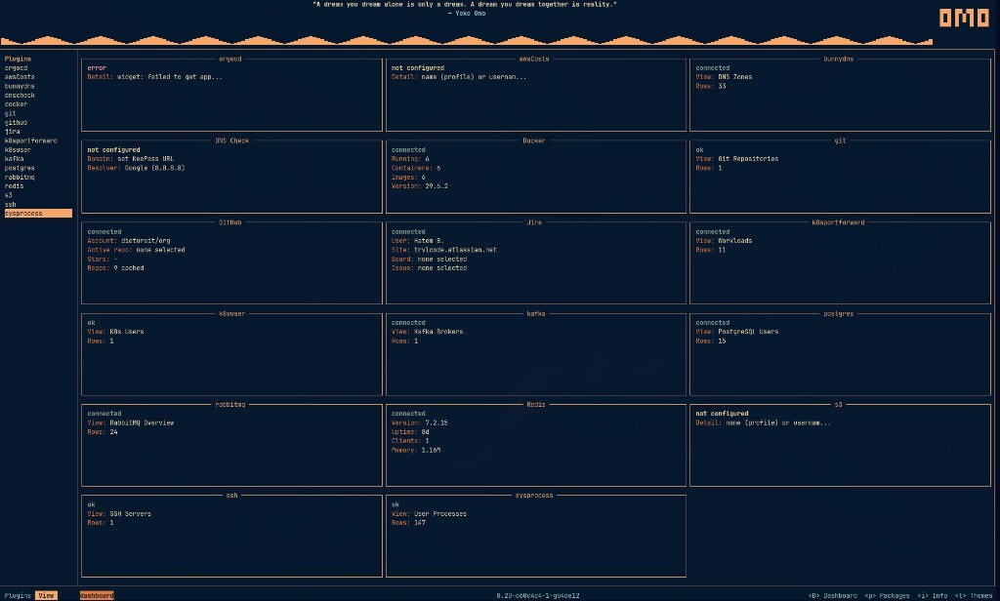
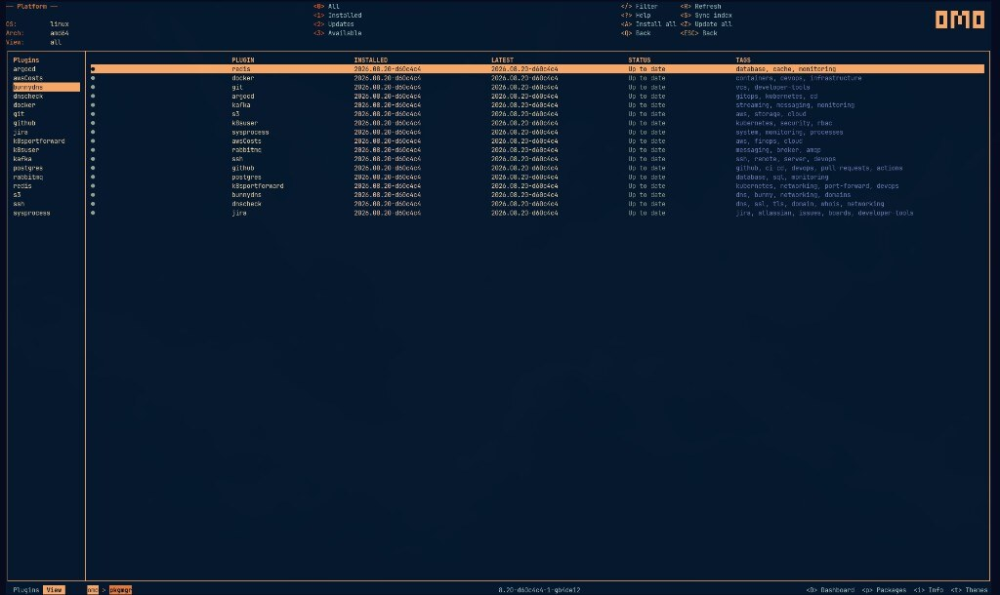
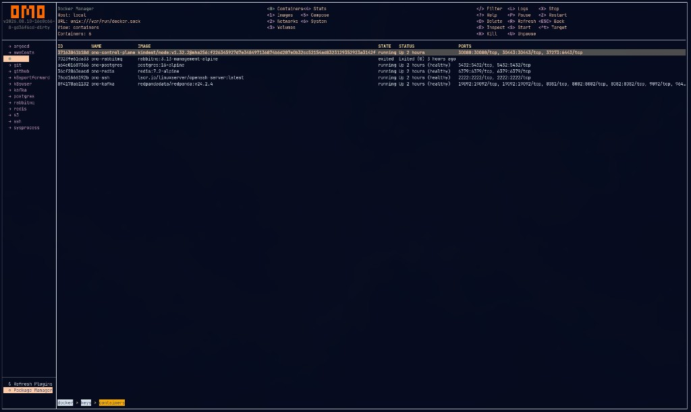
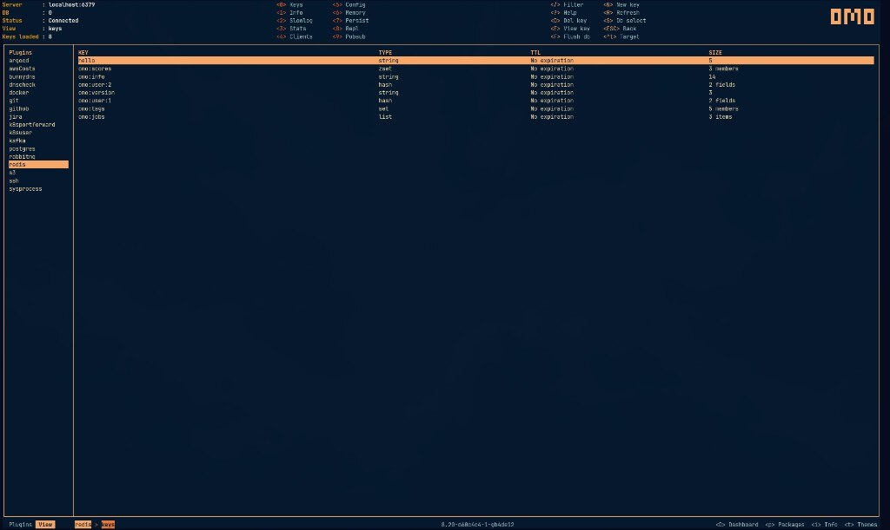
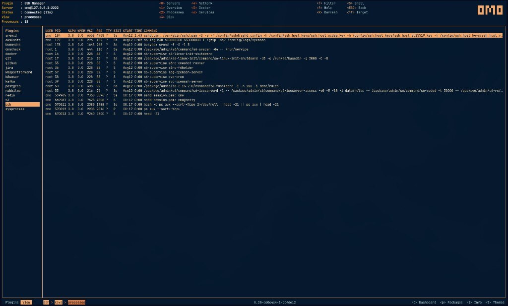
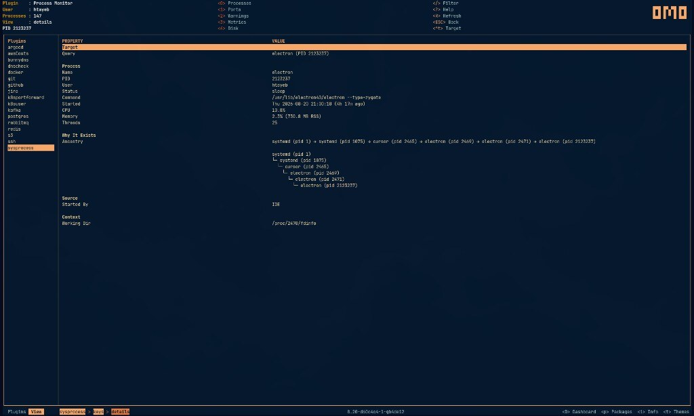

<p align="center">
  
</p>

<p align="center">
  <strong>All your ops tools. One terminal.</strong><br>
  Open-source · Self-hosted · Runs locally
</p>

<p align="center">
  Docker, Kubernetes, Git, SSH, Redis, Postgres, Argo CD, and more — one keyboard-driven TUI,
  backed by a local KeePass vault and out-of-process plugins.
</p>

<p align="center">
  <a href="https://github.com/hatembentayeb/omo/releases"></a>
  <a href="https://github.com/hatembentayeb/omo/actions/workflows/ci.yml"></a>
  <a href="https://goreportcard.com/report/github.com/hatembentayeb/omo"></a>
  <a href="https://github.com/hatembentayeb/omo/blob/main/LICENSE"></a>
  <a href="https://github.com/hatembentayeb/omo/releases"></a>
  
  
</p>

<p align="center">
  <a href="https://oh-myops.com">Website</a> ·
  <a href="#why-omo">Why omo</a> ·
  <a href="#install">Install</a> ·
  <a href="#quick-start">Quick start</a> ·
  <a href="#screenshots">Screenshots</a> ·
  <a href="#plugins">Plugins</a> ·
  <a href="#architecture">Architecture</a> ·
  <a href="#development">Development</a> ·
  <a href="#contributing">Contributing</a>
</p>

---

<p align="center">
  
</p>

<p align="center">
  <sub>Plugin rail on the left. Live tiles on the right. Keyboard shortcuts always visible.</sub>
</p>

---

## Why omo?

Ops work is fragmented. You bounce between the AWS console, `kubectl`, Redis Insight, Docker Desktop, Argo CD, GitHub, SSH sessions, and a password manager — each with its own UI, auth, and muscle memory.

**omo** is a local TUI host. No SaaS. No telemetry. Secrets stay in KeePass under `~/.omo/`. Plugins talk over RPC so a crash in one tool never takes down the cockpit.

| Pain today | With omo |
|------------|----------|
| Ten browser tabs + CLIs | One binary, one keyboard model |
| Credentials scattered in `.env`, shells, and vaults | One KeePass DB under `~/.omo/secrets/` |
| Plugins break when the host Go version changes | Out-of-process **RPC plugins** (hashicorp/go-plugin) |
| New tools mean new UIs to learn | Shared navigation: views, actions, filter, help |

Built for SREs, platform engineers, and indie operators who live in the terminal.

---

## Features

- **Official plugins** — Docker, Redis, Kafka, RabbitMQ, Postgres, SSH, Argo CD, Kubernetes, Git, GitHub, S3, AWS Costs, Bunny DNS, DNS check, Jira, system processes
- **KeePass-backed secrets** — auto-created on first launch; open with KeePassXC or `omo secrets`
- **Package Manager** — sync the plugin index from GitHub and install/update plugins in-app (`p`)
- **Themes** — bundled palettes (Omo + Omarchy); press **`t`** with the plugins list focused
- **Multi-target** — `Ctrl+t` switches instances (e.g. `redis/production/cache` ↔ `redis/staging/cache`)
- **Keyboard-first** — Tab focus, filter (`/`), refresh (`R`), help (`?`), dashboard (`D`); Tab stays inside open modals
- **Safe by design** — credentials stay local; plugins receive config via `Configure`, not nested secret RPC
- **Cross-platform host** — Linux / macOS / Windows; plugins ship as standalone executables

---

## Install

### One-liner (recommended)

```bash
curl -fsSL https://raw.githubusercontent.com/hatembentayeb/omo/main/install.sh | bash
```

Installs the latest release into `/usr/local/bin` and `man omo` into `/usr/local/share/man/man1` (override with `OMO_INSTALL_DIR` / `OMO_MANDIR`) and creates `~/.omo/`.

### Termux (Android)

```bash
pkg install curl tar man
curl -fsSL https://raw.githubusercontent.com/hatembentayeb/omo/main/install.sh | bash
```

Detects Termux and installs into `$PREFIX/bin` and `$PREFIX/share/man/man1` (no sudo). Needs a 64-bit device (`aarch64` or `x86_64`).

### From GitHub Releases

Download the archive for your OS/arch from the [Releases](https://github.com/hatembentayeb/omo/releases) page, extract `omo`, and put it on your `PATH`.

### From source

```bash
git clone https://github.com/hatembentayeb/omo.git
cd omo
make build    # builds host + plugins, installs omo + man page globally
```

Installs `omo` to `/usr/local/bin` (on `PATH`) and `man omo` to `/usr/local/share/man/man1`. Override with `PREFIX` (default `/usr/local`) or `OMO_INSTALL_DIR` / `OMO_MANDIR`. `make all` builds without the global copy.

Requires **Go 1.25+**.

---

## Quick start

### 1. Launch

```bash
omo
```

On first run, omo:

1. Generates `~/.omo/keys/omo.key`
2. Creates `~/.omo/secrets/omo.kdbx` (unlocked by that key file)

> **Back up `~/.omo/keys/omo.key`.** Without it you cannot open the secrets database.

### 2. Install plugins

Inside omo:

1. Focus the **plugins list** (left sidebar) and press **`p`**
2. Press **`S`** to sync the plugin index
3. Press **`A`** to install all plugins (or install selectively)
4. Press **`Q`** or **Esc** to return

### 3. Add a connection

Every connection is a KeePass entry:

```text
<plugin>/<environment>/<instance>
```

Examples: `redis/production/cache-01`, `docker/development/local`, `k8sportforward/development/playground`.

**Option A — CLI (scriptable):**

```bash
omo secrets put redis/development/local \
  --url localhost \
  --password mypass \
  --attr port=6379 \
  --attr database=0

omo secrets list redis
omo secrets get  redis/development/local
```

**Option B — KeePassXC:**

1. Open `~/.omo/secrets/omo.kdbx`
2. Authenticate with **Key File** → `~/.omo/keys/omo.key`
3. Create groups `redis` → `development`, entry `local`
4. Set URL / username / password and custom attributes (`port`, …)

### 4. Operate

Select the plugin in the sidebar. Use `Ctrl+t` to pick the target, `?` for plugin help, `R` to refresh.

---

## Screenshots

No mockups — these are the same screens you run every day.

<p align="center">
  
</p>
<p align="center"><sub><strong>Dashboard</strong> — plugin rail on the left, live tiles on the right. Open with <code>D</code>.</sub></p>

<p align="center">
  
</p>
<p align="center"><sub><strong>Package Manager</strong> — sync the index, install, and update plugins without leaving the TUI.</sub></p>

<p align="center">
  
</p>
<p align="center"><sub><strong>Docker</strong> — containers, images, networks, volumes, and compose — keyboard-first.</sub></p>

<p align="center">
  
</p>
<p align="center"><sub><strong>Redis</strong> — keys, info, slowlog, clients, and pub/sub.</sub></p>

<p align="center">
  
</p>
<p align="center"><sub><strong>SSH</strong> — remote processes, disk, network, Docker, and services.</sub></p>

<p align="center">
  
</p>
<p align="center"><sub><strong>Process Monitor</strong> — local processes, ports, warnings, and why something is running.</sub></p>

More on the site: [oh-myops.com](https://oh-myops.com/#screenshots).

---

## Plugins

| Plugin | What you manage | KeePass path |
|--------|-----------------|--------------|
| **docker** | Containers, images, networks, volumes, Compose | `docker/<env>/<host>` |
| **redis** | Keys, memory, clients, slowlog, pub/sub | `redis/<env>/<instance>` |
| **kafka** | Brokers, topics, partitions, consumer groups | `kafka/<env>/<cluster>` |
| **rabbitmq** | Queues, exchanges, bindings, connections | `rabbitmq/<env>/<instance>` |
| **postgres** | Databases, users, queries, replication | `postgres/<env>/<instance>` |
| **ssh** | Remote shell, processes, disk, services | `ssh/<env>/<server>` |
| **argocd** | Apps, projects, accounts, RBAC | `argocd/<env>/<instance>` |
| **k8suser** | Cert-based users & roles | `k8suser/<env>/<cluster>` |
| **k8sportforward** | Deployments / StatefulSets / Services / Pods port-forward | `k8sportforward/<env>/<cluster>` |
| **bunnydns** | Bunny.net DNS zones, records, DNSSEC, stats, certificates | `bunnydns/<env>/<account>` |
| **dnscheck** | Dig-style DNS, SSL expiry, mail auth, HTTP, WHOIS | `dnscheck/<env>/<domain>` or press **L** |
| **awsCosts** | Cost explorer, budgets, forecasts | `awsCosts/<env>/<profile>` |
| **s3** | Buckets, objects, ACL, lifecycle, multipart | `s3/<env>/<profile>` |
| **git** | Status, commits, branches, stash | `git/<env>/<repo>` |
| **github** | PRs, Actions, secrets, variables, releases | `github/<env>/<account>` |
| **sysprocess** | Local processes, CPU, memory, disk, ports | *(no KeePass entry)* |

Plugin metadata lives in [`plugins.meta.yaml`](plugins.meta.yaml); the published index is [`index.yaml`](index.yaml).

### KeePass field mapping

| Field | Typical use |
|-------|-------------|
| **Title** | Instance display name |
| **URL** | Host / endpoint / socket |
| **UserName** | Username |
| **Password** | Password / token / secret key |
| **Notes** | Free-form description |
| **Custom attributes** | `port`, `database`, `region`, `ssl_mode`, `kubeconfig`, … |

Empty fields are ignored — only set what the plugin needs.

<details>
<summary><strong>Example entries</strong></summary>

**Redis** — `redis/production/cache-main`

| Field | Value |
|-------|-------|
| URL | `redis.example.com` |
| Password | `…` |
| `port` | `6379` |
| `database` | `0` |

**Postgres** — `postgres/production/app-db`

| Field | Value |
|-------|-------|
| URL | `db.example.com` |
| UserName | `admin` |
| Password | `…` |
| `port` | `5432` |
| `database` | `myapp` |
| `ssl_mode` | `require` |

**Docker** — `docker/development/local`

| Field | Value |
|-------|-------|
| URL | `unix:///var/run/docker.sock` |

**Kubernetes port-forward** — `k8sportforward/development/playground`

| Field | Value |
|-------|-------|
| `kubeconfig` | `~/.kube/config` |
| `context` | `kind-omo-playground` *(optional)* |
| `namespace` | `demo` *(optional default filter)* |

**Bunny DNS** — `bunnydns/production/main`

| Field | Value |
|-------|-------|
| Password | Bunny account AccessKey |
| URL | `https://api.bunny.net` *(optional)* |

**SSH** — `ssh/production/web-01`

| Field | Value |
|-------|-------|
| URL | `10.0.1.50` |
| UserName | `deploy` |
| `port` | `22` |
| `auth_method` | `key` |
| `private_key_path` | `~/.ssh/id_ed25519` |

</details>

---

## `omo secrets` CLI

Manage the vault without a GUI (CI-friendly):

```bash
omo secrets list [prefix]
omo secrets get  <plugin/env/name>
omo secrets put  <plugin/env/name> [--username U] [--password P] [--url U] [--notes N] [--attr k=v]
omo secrets delete <plugin/env/name>
omo secrets reset --yes   # deletes omo.kdbx; key file is kept
```

Run `omo secrets` with no args for full help.

---

## Keyboard shortcuts

### Global

| Key | Action |
|-----|--------|
| **Tab** / **Shift+Tab** | Cycle focus (plugins ↔ main ↔ actions); inside a modal, move between its fields/buttons only |
| **↑ / ↓** | Move selection |
| **Enter** | Activate |
| **r** | Refresh plugins *(plugins list focused)* |
| **D** | Dashboard *(plugins list focused)* |
| **p** | Open Package Manager *(plugins list focused)* |
| **i** | Open Settings / Info *(plugins list focused)* |
| **t** | Themes *(plugins list focused)* |

### Inside a plugin

| Key | Action |
|-----|--------|
| **Ctrl+t** | Switch target / connection |
| **R** | Refresh view |
| **/** | Filter rows |
| **?** | Help (plugin + global bindings) |
| **Esc** | Back / home / dismiss modal |

Plugin-specific actions are listed in `?` and in the actions column.

---

## Architecture

```text
┌─────────────────────────────────────────────────────────┐
│  KeePass  ~/.omo/secrets/omo.kdbx  +  ~/.omo/keys/omo.key│
│    redis/prod/cache · docker/dev/local · s3/prod/main … │
└──────────────────────────┬──────────────────────────────┘
                           │ host resolves secrets
┌──────────────────────────▼──────────────────────────────┐
│  omo host (cmd/omo)                                     │
│  · TUI (tview/tcell)                                    │
│  · Package Manager + plugin launcher                    │
│  · Configure → GetView / DoAction over RPC              │
└──────────────────────────┬──────────────────────────────┘
                           │ hashicorp/go-plugin (exec)
         ┌─────────────────┼─────────────────┐
         ▼                 ▼                 ▼
   plugin-redis      plugin-docker      plugin-s3  …
   (ViewData)        (ViewData)         (ViewData)
```

**Why RPC plugins?** Native Go plugins (`.so`) break across Go versions. omo plugins are separate binaries spoken to over RPC, so the host and plugins can be released independently and cross-compiled cleanly.

### On-disk layout

```text
~/.omo/
├── secrets/omo.kdbx     # credentials (KeePass KDBX4)
├── keys/omo.key         # master key file — back this up
├── index.yaml           # remote plugin catalog (synced)
├── installed.yaml       # what you have installed
├── logs/                # omo.log + per-plugin logs
├── theme                # saved TUI theme id
└── plugins/
    ├── redis/redis
    ├── docker/docker
    └── …
```

### Repository layout

```text
cmd/omo/           # host binary + secrets CLI
internal/host/     # TUI host, RPC renderer, package manager wiring
pkg/
  pluginrpc/       # RPC contract (ViewData, DoAction, …)
  pluginapi/       # shared metadata / logging helpers
  secrets/         # KeePass integration
  ui/              # reusable TUI widgets
plugins/<name>/    # one directory per official plugin
  cmd/<name>/      # plugin main (Serve)
dev/               # local stacks + KeePass seed scripts
```

---

## Development

### Prerequisites

- Go **1.25+**
- Docker (optional, for `make dev-setup` stacks)
- KeePassXC (optional, for inspecting the vault)

### Common commands

```bash
make build        # build host + plugins, install omo to PATH and man omo
make all          # same build, skip the global copy
make plugin-redis # rebuild a single plugin quickly
make clean        # remove local ./omo binary (keeps ~/.omo)
make purge        # remove ~/.omo entirely (destructive)

make dev-setup    # start/seed local Redis/Kafka (and friends) via dev/
make dev-seed     # seed KeePass for plugins that don't need Docker
```

After `make build`, run `omo` from anywhere on your PATH and `man omo` for the manual. After `make all`, use `./omo` or your Go bin.

### Project checks

```bash
go mod tidy
go vet ./...
go build ./cmd/omo
# CI also builds every plugin under plugins/*/cmd/*
```

CI workflow: [`.github/workflows/ci.yml`](.github/workflows/ci.yml).

### Writing a plugin (overview)

1. Implement `pluginrpc.Plugin`:

   ```go
   GetMetadata() (pluginapi.PluginMetadata, error)
   Configure(pluginrpc.ConfigureRequest) error
   GetView(pluginrpc.ViewRequest) (pluginrpc.ViewData, error)
   DoAction(pluginrpc.ActionRequest) (pluginrpc.ActionResult, error)
   Stop() error
   ```

2. Return tables as `ViewData` (`Headers`, `Rows`, key bindings). The **host** owns rendering.
3. Put an entrypoint at `plugins/<name>/cmd/<name>` that calls `plugin.Serve` with `pluginrpc.ServePluginMap(impl)`.
4. Register the plugin in `plugins.meta.yaml`.
5. Add a `dev/<name>/setup.sh` (and KeePass seed) so reviewers can try it locally.

Study a full example: [`plugins/redis/`](plugins/redis/).

### Configuration contract

The host loads KeePass settings and calls `Configure` with a `map[string]string` (host, port, password, …). Plugins must **not** open nested RPC back to secrets during `GetView` — that deadlocks net/rpc on the shared mux.

### Logging

- Host: `~/.omo/logs/omo.log`, `rpc-host.log`
- Plugins: `~/.omo/logs/<plugin>.log`

---

## Security notes

- Credentials never leave your machine unless *you* point a plugin at a remote service.
- Prefer the key file model; treat `~/.omo/keys/omo.key` like a private key.
- Use `omo secrets` in automation instead of committing passwords.
- Review plugin source before installing third-party plugins (same as any ops tool).

---

## Roadmap

- [x] `omo secrets` CLI
- [x] RPC plugins (no Go `.so` version skew)
- [x] Kubernetes port-forward plugin
- [x] Bunny DNS plugin
- [ ] Richer plugin SDK / lifecycle docs
- [ ] Prometheus / Grafana plugin
- [ ] Theme / color customization
- [ ] Community plugin registry guidelines

Ideas and bugs: [GitHub Issues](https://github.com/hatembentayeb/omo/issues).

---

## Contributing

Contributions are welcome — bug fixes, plugins, docs, and DX improvements.

1. Fork and create a branch (`feat/…`, `fix/…`)
2. Keep changes focused; match existing style
3. Ensure `go vet ./...` and builds succeed (`make all` or CI-equivalent)
4. For plugins: include `dev/` setup + a KeePass seed path so maintainers can test
5. Open a PR against `main` with a clear summary and test notes

Please be respectful in issues and PRs. This is a community project.

---

## Build matrix

| OS | Arch | Host | Plugins |
|----|------|------|---------|
| Linux | amd64 / arm64 | ✅ | ✅ |
| macOS | amd64 / arm64 | ✅ | ✅ |
| Windows | amd64 | ✅ | ✅ |

Release automation: [`.github/workflows/release.yml`](.github/workflows/release.yml).

---

## License

Apache License 2.0 — see [LICENSE](LICENSE).

---

<p align="center">
  <sub>
    Built for people who operate systems from a shell.<br>
    <a href="https://oh-myops.com">oh-myops.com</a> ·
    <a href="https://github.com/hatembentayeb/omo">GitHub</a>
  </sub>
</p>
